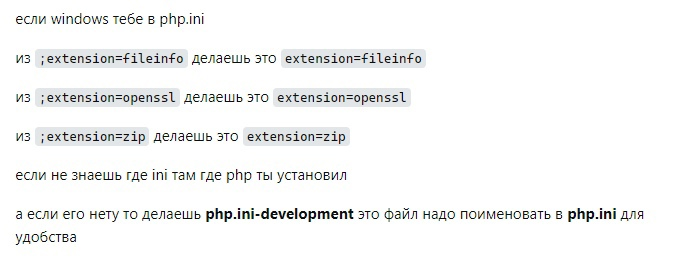
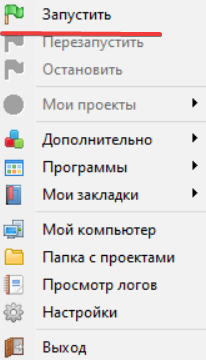
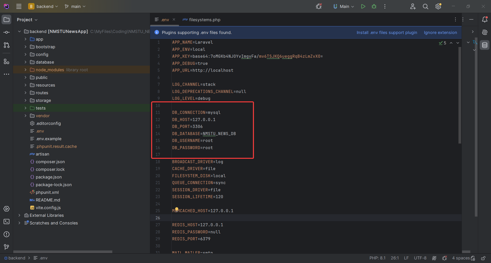
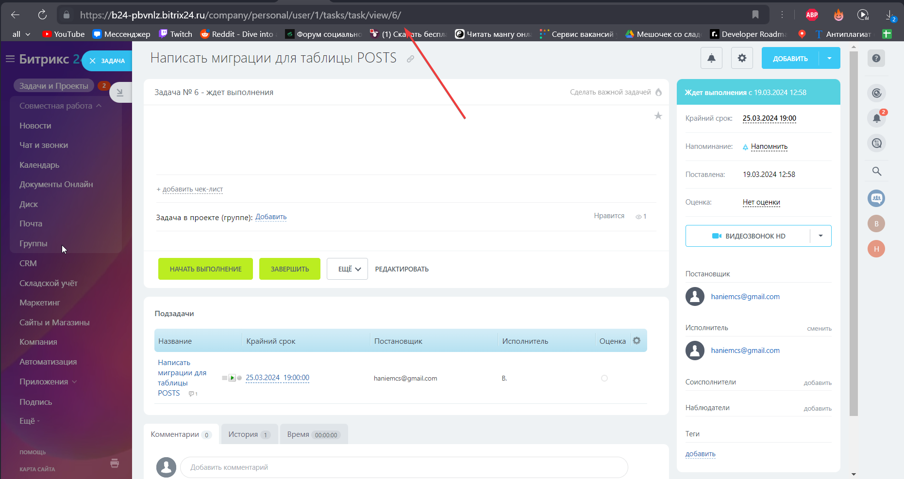

# NMSTU_NEWS_PROJECT

Гитить только всю верхнюю папку. 

Подтягивайте чужие коммиты перед разработкой.

В случае чего отпишите мне https://t.me/qumoshines. Решим этот вопрос.

# Что потребуется для запуска проекта на вашем устройстве:

Для запуска проекта вам понадобиться:
    1. Node Pocket Manager - https://nodejs.org/.
    2. Git bash - https://gitforwindows.org/.
    3 Любое IDE для редактирования кода, но советую PHPStorm(Из него можно запускать проект и это просто очень хороший помошник для написаня PHP кода).
    4. Приложение для базы данных. В целом не принципиально что вы будете использовать, но я лично пользуюсь Open Server:
        1. Open Server - https://ospanel.io/.
        2. Sql server - https://www.microsoft.com/en-us/sql-server/sql-server-downloads.

        **Примечание**
        В php.ini(файл в папке с php которую вы устанавливаете далее, нужно убрать ";" в строке ;extencion=pdo_mysql)

Php8 - https://www.php.net/downloads.php
Для настройки php вам потребуется выполнить эти действия:
    1. скачать архив thread save php последней версии.
    2. Выгрузить все файлы в папку C:/php
    3. Сделать действия, которые описаны на изображении.
    
    4. Нажать правой на мой комьютер и перейти в свойства. Перейти в дополнительные параметры и и открыть меню "переменные среды". В окне системные переменные нажать левой кнопкой мыши на path и нажать кнопку изменить. Создать новое поле и внести в него "C:\php".
    
Далее установить Composer - https://getcomposer.org/

# Выгрузка проекта с гит:

Последовательность действий для выгрузки проекта с гита: 
    1.Запустить гит баш в нужной папке
    2.Прописать команду - "git clone https://github.com/Haniem/NMSTU_NEWS_PROJECT.git"
    3.Потребуется авторизиация в git bash с помощью вашего аккаунта git
    4.Проект автоматически проинициализируется и будет готов к работе.

# Запуск сервера:

Последовательность действий для запуска проекта:
    1.Открыть командную строку в папке backend
    2.Прописать команду "npm install" и "composer install"(Подгрузит все необходимые пакеты)
    3.Прописать команду "php artisan serve" - она запустит локальный сервер и предоставит ссылку на него

# Подключение базы данных:

Последовательность действий для работы с БД (Объясню на примере Open Server):
    1.В настройках включить работу SQL последней версии
    2.Запустить open server
    
    3.Создать базу данных в phpmyadmin
    4.Настроить env файл(Название базы данных, Юзер логин и пароль)
    

# Процедура до начала работы над задачей:

Последовательность действий: 
    1.Перейти в ветку мейн. Загрузить все изменения из ветки main  - git pull origin main.
    2.Создать отдельную ветку для вашей задачи используя в названии номер задачи, который указан в адрессной строке при просмотре деталки задачи на битриксе(Например: git checkout -b 6_Posts_Migration).
    
    3.Начать работу над задачей.

# Процедура выгрузки выполненной задачи на гит:

Последовательность действий: 
    1.Прописать "git status" и проверить измененные файлы на предмет ошибок.
    2.Добавить нужные файлы в будущий комит - "git add <название файла>". Или выполнить добавление всех измененных файлов в комит - "git add .".
    3.Создать комит написав к нему коментарий с названием задачи - "git commit -m "6_Posts_Migration".
    4.Запушить вашу ветку на гит - git push origin 6_Posts_Migration. Где "6_Posts_Migration" название вашей ветки".

# Схема базы данных:

https://app.diagrams.net/?src=about#G1Ytr6WLAFwn2XG05uUKkv2OO3QOQPm3yN#%7B%22pageId%22%3A%22dkBTHd9Ru4eEBB2xRWGK%22%7D

